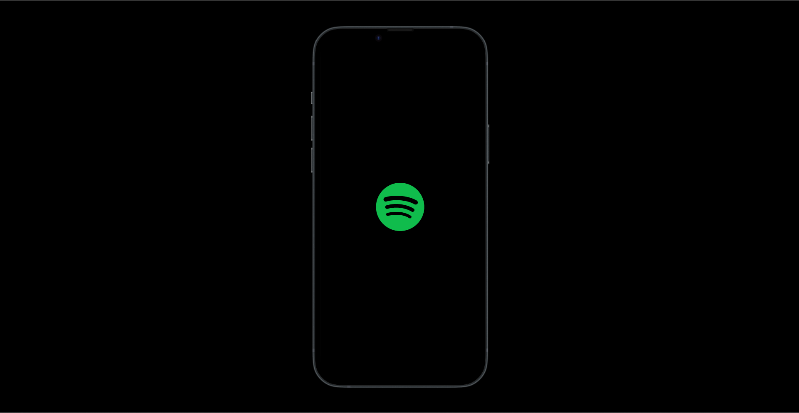
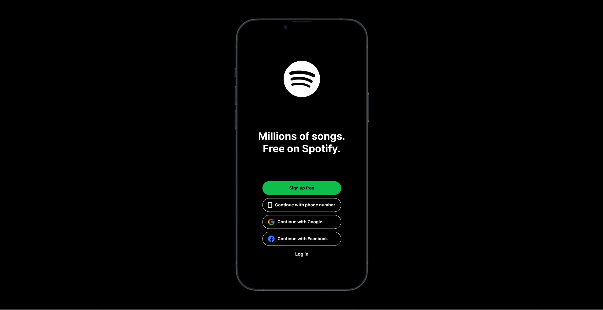
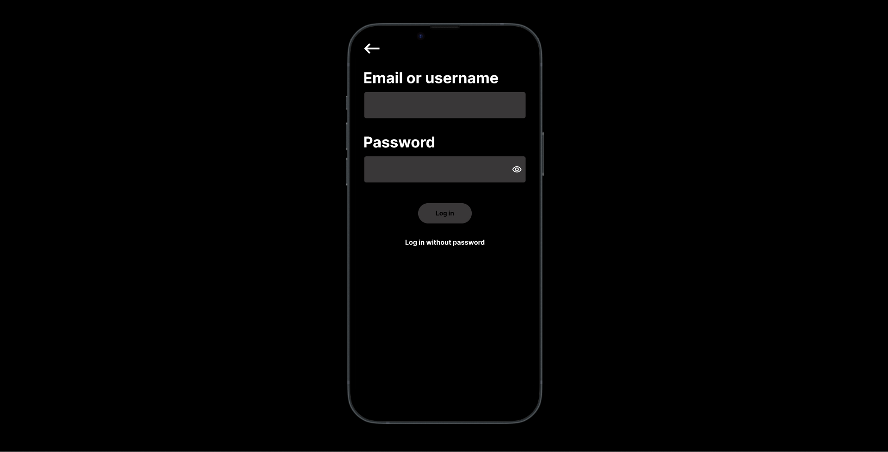
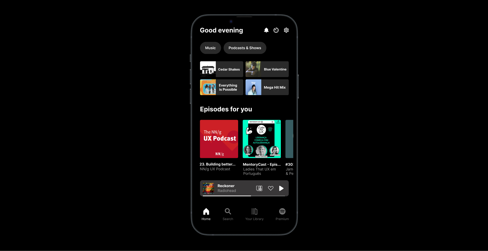

# Event Registration Web Application

## AIM:
To design, develop and deploy a web application for event registration.

## DESIGN STEPS:

### Step 1:
Create a new frame.

### Step 2:
Select any one preset size of your choice.

### Step 3:
Select the shapes you need.

### Step 4:
Import images as needed.

### Step 5:
Create pages based on your need and link them.

### Step 6:

Validate the HTML and CSS code.

### Step 6:

Publish the website in the given URL.

## DESIGN TOOL:
Figma

# CODE

```
LOGO

/* Background */
position: absolute;
left: 0%;
right: 0%;
top: 0%;
bottom: 0%;
background: #000000;

/* Logo / Spotify */
position: absolute;
width: 129px;
height: 129px;
left: calc(50% - 129px/2 - 0.5px);
top: calc(50% - 129px/2);

SIGN UP-CONTINUE-LOGIN
/* Background */
position: absolute;
left: 0%;
right: 0%;
top: 0%;
bottom: 0%;
background: #000000;

/* Logo / Spotify */
position: absolute;
width: 129px;
height: 129px;
left: calc(50% - 129px/2 - 0.5px);
top: 129.76px;

/* Millions of songs. Free on Spotify. */
position: absolute;
width: 308px;
height: 88px;
left: calc(50% - 308px/2 - 1px);
top: 375px;
font-family: 'Inter';
font-style: normal;
font-weight: 700;
font-size: 36px;
line-height: 44px;
text-align: center;
color: #FFFFFF;

/* Btn / Sign up */
/* Auto layout */display: flex;
flex-direction: row;
justify-content: center;
align-items: center;
padding: 0px;
gap: 10px;
position: absolute;
width: 279px;
height: 49px;
left: calc(50% - 279px/2 - 0.5px);
top: calc(50% - 49px/2 + 118.5px);

/* Main color */
background: #10BC4C;
border-radius: 30px;

/* Btn / Phone Number */
box-sizing: border-box;

/* Auto layout */
display: flex;
flex-direction: row;
align-items: center;
padding: 0px 20px;
gap: 10px;
position: absolute;
width: 279px;
height: 49px;
left: calc(50% - 279px/2 - 0.5px);
top: calc(50% - 49px/2 + 178.5px);
border: 1px solid #FFFFFF;
border-radius: 30px;

/* Btn / google */
box-sizing: border-box;
/* Auto layout */
display: flex;
flex-direction: row;
align-items: center;
padding: 0px 20px;
gap: 10px;
position: absolute;
width: 279px;
height: 49px;
left: calc(50% - 279px/2 - 0.5px);
top: calc(50% - 49px/2 + 238.5px);
border: 1px solid #FFFFFF;
border-radius: 30px;
/* Btn / Facebook */
box-sizing: border-box;
/* Auto layout */
display: flex;
flex-direction: row;
align-items: center;
padding: 0px 20px;
gap: 10px;
position: absolute;
width: 279px;
height: 49px;
left: calc(50% - 279px/2 - 0.5px);
top: calc(50% - 49px/2 + 298.5px);
border: 1px solid #FFFFFF;
border-radius: 30px;

/* Log in */
position: absolute;
width: 48px;
height: 19px;
left: calc(50% - 48px/2 - 0.5px);
top: 806.38px;
font-family: 'Inter';
font-style: normal;
font-weight: 700;
font-size: 16px;
line-height: 19px;
text-align: center;
color: #FFFFFF;

EMAIL OR USERNAME

/* Background */
position: absolute;
left: 0%;
right: 0%;
top: 0%;
bottom: 0%;
background: #000000;

/* Email or username */
position: absolute;
width: 326px;
height: 44px;
left: calc(50% - 326px/2 - 33.73px);
top: 89.63px;
font-family: 'Inter';
font-style: normal;
font-weight: 700;
font-size: 36px;
line-height: 44px;

/* identical to box height */
text-align: center;
color: #FFFFFF;

/* Password */
position: absolute;
width: 174px;
height: 44px;
left: calc(50% - 174px/2 - 109.71px);
top: 244.72px;
font-family: 'Inter';
font-style: normal;
font-weight: 700;
font-size: 36px;
line-height: 44px;
/* identical to box height */
text-align: center;
color: #FFFFFF;

/* Input box / Email */
position: absolute;
width: 388px;
height: 63px;
left: 20px;
top: 146px;
background: #393738;
border-radius: 5px;

/* Btn / Sign up */
/* Auto layout */
display: flex;
flex-direction: row;
justify-content: center;
align-items: center;
padding: 0px;
gap: 10px;
position: absolute;
width: 129px;
height: 49px;
left: calc(50% - 129px/2);
top: calc(50% - 49px/2 - 24.5px);
background: #393738;
border-radius: 30px;

/* Log in without password */
position: absolute;
width: 192px;
height: 19px;
left: calc(50% - 192px/2);
top: 499.1px;
font-family: 'Inter';
font-style: normal;
font-weight: 700;
font-size: 16px;
line-height: 19px;
text-align: center;
color: #FFFFFF;

/* Icon / Arrow back */
position: absolute;
width: 37px;
height: 25px;
left: 19.67px;
top: 28.44px;

/* Input box / Password */
/* Auto layout */
display: flex;
flex-direction: row;
justify-content: flex-end;
align-items: center;
padding: 24px 10px 24px 15px;
gap: 10px;
position: absolute;
width: 388px;
height: 63px;
left: 20px;
top: 301px;
background: #393738;
border-radius: 5px;

HOME
/* Background */
position: absolute;
left: 0%;
right: 0%;
top: 0%;
bottom: 0%;
background: #000000;

/* Rectangle 3 */
position: absolute;
width: 189px;
height: 69px;
left: 20px;
top: 185px;
background: #2A2A2A;
border-radius: 5px;

/* Rectangle 5 */
position: absolute;
width: 189px;
height: 69px;
left: 20px;
top: 264px;
background: #2A2A2A;
border-radius: 5px;

/* Rectangle 4 */
position: absolute;
width: 189px;
height: 69px;
left: 219px;
top: 185px;
background: #2A2A2A;
border-radius: 5px;

/* Rectangle 6 */
position: absolute;
width: 189px;
height: 69px;
left: 219px;
top: 264px;
background: #2A2A2A;
border-radius: 5px;

/* Podcasts Scroll */
position: absolute;
width: 428px;
height: 244px;
left: 0px;
top: 441px;
overflow-x: scroll;

/* Episodes for you */
position: absolute;
width: 228px;
height: 34px;
left: 20px;
top: 376.93px;
font-family: 'Inter';
font-style: normal;
font-weight: 700;
font-size: 28px;
line-height: 34px;
/* identical to box height */
color: #FFFFFF;

/* Cedar shakes cover */
position: absolute;
width: 69px;
height: 68.93px;
left: 20px;
top: calc(50% - 68.93px/2 - 243.53px);
background: url(a3890257485_2.jpg);
border-radius: 5px 0px 0px 5px;
/* Cedar Shakes */
position: absolute;
width: 108.83px;
height: 17px;
left: 99.17px;
top: calc(50% - 17px/2 - 243.03px);
font-family: 'Inter';
font-style: normal;
font-weight: 700;
font-size: 14px;
line-height: 17px;
/* identical to box height */
color: #FFFFFF;
/* Mutantes cover */
position: absolute;
width: 68.93px;
height: 68.93px;
left: 20px;
top: calc(50% - 68.93px/2 - 164.6px);
background: url(a1699171970_7.jpg);
border-radius: 5px 0px 0px 5px;

/* Everything is Possible */
position: absolute;
width: 95.01px;
height: 36px;
left: 94.93px;
top: calc(50% - 36px/2 - 163.6px);
font-family: 'Inter';
font-style: normal;
font-weight: 700;
font-size: 15px;
line-height: 18px;
text-align: center;
color: #FFFFFF;

/* Blue valentine cover */
position: absolute;
width: 68.93px;
height: 68.93px;
left: 219px;
top: calc(50% - 68.93px/2 - 243.53px);
background: url(a2296115650_2.jpg);
border-radius: 5px 0px 0px 5px;

/* Blue Valentine */
position: absolute;
width: 99px;
height: 17px;
left: 300px;
top: calc(50% - 17px/2 - 243.5px);
font-family: 'Inter';
font-style: normal;
font-weight: 700;
font-size: 14px;
line-height: 17px;
/* identical to box height */
color: #FFFFFF;

/* _rock-classics 1 */
position: absolute;
width: 68.93px;
height: 68.93px;
left: 219px;
top: calc(50% - 68.93px/2 - 164.6px);
background: url(_mega-hit-mix.jpg);
border-radius: 5px 0px 0px 5px;

/* Mega Hit Mix */
position: absolute;
width: 96px;
height: 18px;
left: 298.93px;
top: calc(50% - 18px/2 - 163.6px);
font-family: 'Inter';
font-style: normal;
font-weight: 700;
font-size: 15px;
line-height: 18px;
text-align: center;

color: #FFFFFF;
/* Btn / Music */
/* Auto layout */
display: flex;
flex-direction: row;
justify-content: center;
align-items: center;
padding: 20px;
gap: 10px;
position: absolute;
width: 92px;
height: 53px;
left: 20px;
top: 100px;

/* Grey Btn */
background: #2A2A2A;
border-radius: 30px;

/* Btn / Podcasts */

/* Auto layout */
display: flex;
flex-direction: row;
justify-content: center;
align-items: center;
padding: 20px;
gap: 10px;
position: absolute;
width: 187px;
height: 53px;
left: 123.15px;
top: 100px;

/* Grey Btn */
background: #2A2A2A;
border-radius: 30px;

/* Header */
position: absolute;
width: 388.93px;
height: 34px;
left: 19.07px;
top: 32px;

/* Player / Radiohead */
position: absolute;
width: 388px;
height: 70px;
left: 20px;
top: 705px;

/* Menu footer */
position: absolute;
width: 382px;
height: 55px;
left: 27px;
top: 827px;

```

## OUTPUT:





## RESULT:
The program to design, develop and deploy a web application for event registration is completed successfully.